<div align="center">

<p>
  
</p>

<p>
  <a href="https://github.com/atifkhani397"></a>
  <a href="mailto:atif83837@gmail.com"></a>
</p>

</div>

---

## 🧠 About Me

```json
{
  "name": "Muhammad Atif",
  "role": "Software Engineering Student",
  "focus": ["AI & Agentic AI", "RAG", "Backend Engineering"],
  "builds": ["Research automation", "Retrieval systems", "AI-powered software"],
  "approach": "Clear systems. Useful outcomes. Continuous improvement."
}
```

---

## 🛠️ Technology Stack

### Languages

<p>
  
  
  
  
  
</p>

### AI, Retrieval & Search

<p>
  
  
  
  
  
  
  
  
  
</p>

### Backend & Infrastructure

<p>
  
  
  
  
  
  
</p>

---

## 🚀 Featured Projects

### 💼 [ARA-1 — Autonomous Financial Research Agent](https://github.com/ZethetaIntern/Financial-Research-agent-)

> Collaborator on an autonomous, multi-source financial research agent built for QuantumEdge Research.

**Stack**

<p>
  
  
  
  
  
  
  
  
</p>

**Highlights:** Plan-and-Execute plus ReAct agent loop · SEC EDGAR, Financial Modeling Prep, Tavily, and NewsAPI sources · multi-layer memory with Chroma · multi-source synthesis and source hierarchy · fallback chains and circuit breakers · FastAPI REST/WebSocket layer · React 18 web interface · Docker Compose deployment.

### 🔬 [ORION — Autonomous Research Intelligence System](https://github.com/atifkhani397/Orion)

> An end-to-end research pipeline that fetches academic literature from arXiv, detects research gaps, scores innovation potential, and drafts publication-ready reports with verified references and mathematical typesetting.

**Stack**

<p>
  
  
  
  
  
  
  
  
</p>

**Key capabilities:** 3-layer AI orchestration · hybrid retrieval with BM25 and RRF · Qdrant embeddings · background report generation · PDF rendering · citation verification.

### 📝 [Automated Quiz Scanner & Grading System](https://github.com/Hassan-khan-5535/quiz-scanner-and-grading-system)

> An AI-powered application that scans bubble sheets, decodes QR-based answer keys, extracts handwritten student information, grades responses, and exports detailed Excel/CSV reports.

**Stack**

<p>
  
  
  
  
  
  
  
  
</p>

**Key capabilities:** QR answer-key decoding · handwritten OCR with Gemini Vision and EasyOCR fallback · OpenCV bubble detection · invalid and unattempted response handling · batch folder processing · Excel/CSV reporting · Streamlit interface.

### 🎮 [Othello-Reversi](https://github.com/atifkhani397/Othello-reversi-)

> A Java implementation of the classic Othello/Reversi board game using object-oriented design and a Minimax-based AI opponent.

**Stack**

<p>
  
  
  
  
</p>

---

## 📈 GitHub Analytics

<p align="center">
  <a href="https://github.com/atifkhani397"></a>
  <a href="https://github.com/atifkhani397?tab=repositories"></a>
  <a href="https://github.com/atifkhani397/atifkhani397/commits/main"></a>
</p>

---

## 🎯 Current Focus

| Area | Focus |
| --- | --- |
| 🤖 AI | Agentic AI, RAG, and LangGraph |
| 🔎 Retrieval | Qdrant, DuckDB, BM25, Hybrid Search, and RRF Fusion |
| ⚡ Backend | FastAPI, REST APIs, Uvicorn, and production AI systems |
| 🏗️ Engineering | Software architecture and reliable developer workflows |

## 📬 Connect

<p>
  <a href="https://github.com/atifkhani397"></a>
  <a href="mailto:atif83837@gmail.com"></a>
</p>

> “Build systems that make complex work feel simple.”
>
> — Muhammad Atif

<div align="center">
  <sub>Focused on building useful software at the intersection of AI and engineering.</sub>
</div>
